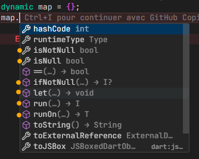

A list of very useful extensions that allow you to execute code or a variable before assignment,
or to check for null.

## Features

[Inspired by Kotlin Scope functions](https://kotlinlang.org/docs/scope-functions.html) — visit for more information 🚩

This package allows you to execute code on a variable or data type.
Useful when you want to perform an operation on a variable's value before assigning it.

Note: These extensions work on all types.

## Getting started

Start by importing this in your file:

```dart
import 'package:run_it/run_it.dart';
```

And that's it! You have a whole range of extensions available in your code.



Extended to Dart core types.

```dart
TYPES RUNNERS

 T = Value Type
 R = Return Type
 x = void

 R             T(it)
bool isTrue = yesIsTrue.run((it) {---})

return   methods    parameter
   R        run        x
   R      T.run        T
   T      T.runOn      T
   x      T.let        T
   x        --         x
   T        --         x
```

[Visit, for more details](https://kotlinlang.org/docs/scope-functions.html#function-selection)

## Usage

```dart
// [run] will have `null` or `void` as derfault return tupe.
run(() => print('Hello World'));

// [run] will have [int] as return type.
int time = run(() => 10);

// [runOn] will have [int] as return type and [it] will be [int]
int houres = time.runOn((it) => it ~/ 3600);

// [run] will have [double] as return type and [it] will be [int]
double seconds = time.run((it) => it / 1000);

// [let] will have `void` as derfault return tupe.
seconds.let((it) => print("$it seconds AND $houres houres In $time"));

seconds.ifNotNull((it) => print("Seconds is not null: $it"));

// [isNull] will return [bool] as default type.
print("Seconds is null: ${seconds.isNull}");

// [isNotNull] will return [bool] as default type.
print("Seconds is not null: ${seconds.isNotNull}");
print("Time is null: ${time.isNull}");

print("-" * 36);
/* ‼️‼️ Attention this execution can bug, some time. */
dynamic map = {};
map.run((it) => print(it)); // NoSuchMethodError: Class '_Map<dynamic, dynamic>' has no instance method 'run'.
// Use on know types (advice).

/* ------------------------------------------------------------------------ /
| This is a simple example to show how to use the run_it package.
| It demonstrates the use of run, runOn, let, isNull, isNotNull, and ifNotNull methods.
| The example includes basic operations with integers and demonstrates how to handle null checks.
| Note: The last part of the example with dynamic map is intentionally left to show a potential issue with dynamic types.
| It is recommended to use known types to avoid runtime errors.
| This example is for demonstration purposes only and may not be suitable for production use.
|------------------------------------------------------------------------ */
```

[Visit for more exemples](https://kotlinlang.org/docs/scope-functions.html)

## Additional information

Note: These extensions work on all types but may rarely have issues with variables of type [dynamic], especially those containing a [Map].

```dart
dynamic map = {};
map.run((it) => print(it)); // NoSuchMethodError: Class '_Map<dynamic, dynamic>' has no instance method 'run'.
  // Use on know types (advice).
```

Inspired by Kotlin.
[Scope functions](https://kotlinlang.org/docs/scope-functions.html)

[Function selection 🚩](https://kotlinlang.org/docs/scope-functions.html#function-selection)
